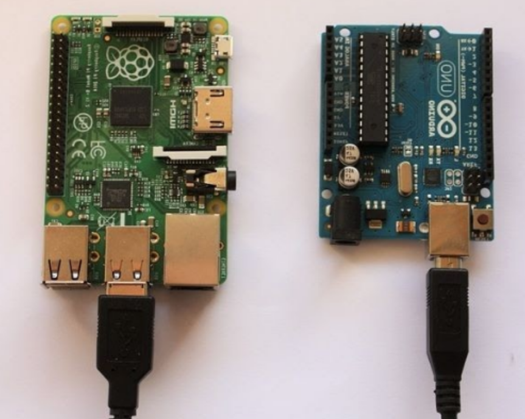
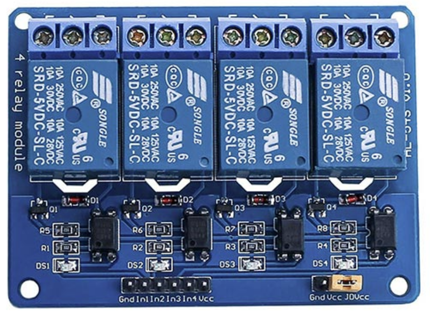
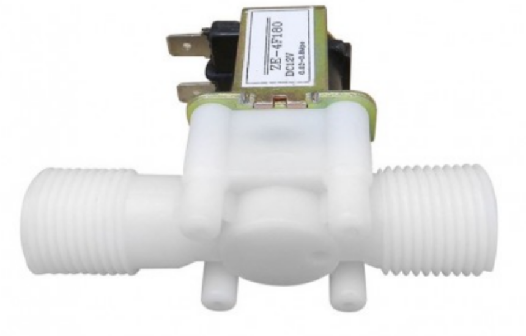

# Components

🔩 The project consist of a Python Application Running on a Raspberry PI connected to an Arduino board where you can set your garden water planning schedule.

## Hardware

There are three main hardware components:

* Raspberry Pi
* Arduino board
* Solenoid Electrovalve

## Raspberry Pi

Raspberry Pi will act as our main computer, which hosts the Open Garden Python Application. For ease of use, the Raspberry Pi will be connected to Touch Panel for Raspberry Pi, where gardeners can use the touch panel to manage the irrigation of their garden.

In addition to the Touch Panel, an Arduino board will be connected to the Raspberry Pi.

### Arduino and open source hardware

[Arduino](https://en.wikipedia.org/wiki/Arduino) is a microcontroller which simplifies control of electrical components. It will be the bridge between our Solenoid Electrovalves and Raspberry Pi. The image below shows our Raspberry Pi (left) and our Arduino board (right):

Open Garden utilizes the Arduino Relay Module as shown below:

### Solenoid Electrovalve

The [Solenoid Electrovalve](https://en.wikipedia.org/wiki/Solenoid_valve) will directly control the waterflow within the valve.

## Software

The Open Garden Python Application is the main piece of software for this project. Below are examples of the interface:

